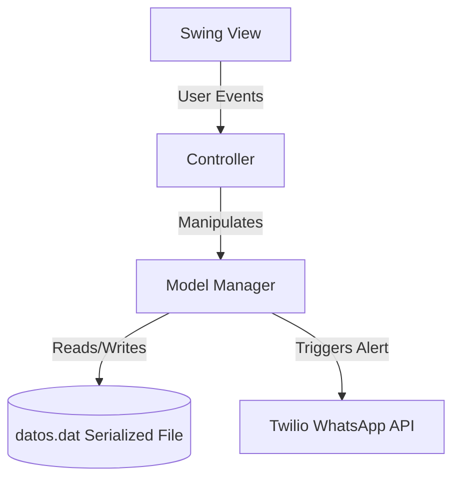

# Gym Management System with Automated WhatsApp Notifications

A robust desktop application written in **Java (21)** utilizing the **Model-View-Controller (MVC)** architectural pattern to streamline gym operations. It enables administrators to manage member registrations, plan subscriptions, class schedules, and automated billing, featuring direct messaging integration via the **Twilio SDK** to send transaction confirmations over WhatsApp.

---

## Technical Architecture

The application is structured into three decoupled layers:

1. **Model (`Modelo/`):** Contains the business logic, objects (Members, Instructors, Memberships, Activities), and managers.
2. **View (`Vista/`):** Built with Java Swing components using NetBeans `AbsoluteLayout` for a responsive UI.
3. **Controller (`Controlador/`):** Mediates input from the View, triggers actions on the Model, and refreshes the presentation layer.



---

## Key Engineering Features

### 1. Automated Messaging Pipeline
Integrates the **Twilio REST API** to automatically format and dispatch WhatsApp messages to members. It uses a manager (`WhatsAppManager`) that initializes credentials securely from environment variables, avoiding credential leaks.
* **Notification Scenarios:** Registration welcomes, membership renewals, schedule updates, and payment invoices.

### 2. Lightweight Object Serialization (Persistence Layer)
Instead of relying on heavy database engines for localized deployments, the system implements a custom persistence layer using native **Java Object Serialization** (`java.io.Serializable`).
* All system states (members list, active sessions, billing history) are serialized into a binary file (`datos.dat`).
* Input/Output streams (`ObjectOutputStream` / `ObjectInputStream`) handle atomic reads and writes upon application startup and shutdown.

---

## Technologies Used

- **Language:** Java 21
- **Dependency Management:** Apache Maven
- **UI Framework:** Java Swing (NetBeans AbsoluteLayout)
- **External APIs:** Twilio SDK (v8.22.0)

---

## Installation & Setup

### Prerequisites
- Java Development Kit (JDK) 21 or higher
- Apache Maven 3.9+

### Configuration
Set the following environment variables on your system to enable WhatsApp notifications:
```bash
export TWILIO_ACCOUNT_SID="your_account_sid"
export TWILIO_AUTH_TOKEN="your_auth_token"
export TWILIO_FROM_PHONE_NUMBER="+14155238886"  # Twilio Sandbox number
```

### Build and Run
1. Clone the repository and navigate to the folder:
   ```bash
   cd gym-management-system
   ```
2. Build the project with Maven:
   ```bash
   mvn clean package
   ```
3. Execute the JAR file:
   ```bash
   mvn exec:java
   ```
